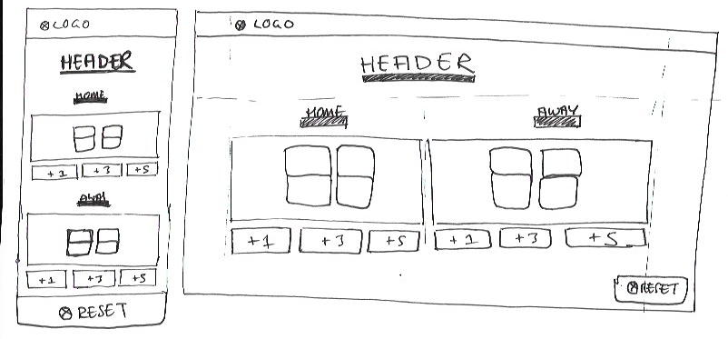
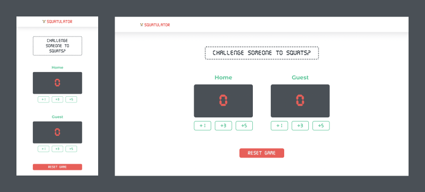

## PLAN

Home & Guest scoreboard button counter using javascript

### OBJECTIVE

Challenge a friend to a game of 'Squatulator' and see who can do the most squats!
Tap the appropriate increment button to increase your score according to how many sqauts you just did. I wonder who can do the most - Good luck!

### TIME SCALE

A few hours

### MVP / REQUIREMENTS

- sketches for layout ✅
- 
- title bar ✅
- scoreboard/counter for both players ✅
- increment buttons for both players ✅
- new game button resets scoreboards/counters to 0 ✅

### STRETCH GOALS / FEATURES

- responsive design ✅
- style with css ✅
- count down timer showing counter
  - timer illustrates who won at the end
- Highlights who is in the lead
- share final scorecard with friends (via email, whatsapp, sms, twitter, instagram)
- Enter your bespoke name instead of home & guest
- Select an icon/mascot to accompany your name

### CODE STEPS

- set up file/folder structure ✅
- layout elements ✅
  - html
- styling ✅
  - css
- functionality of buttons ✅
  - javascript

### LEARNINGS

- Always get functionality of code first and apply final design styling last once functionality is acheived

### MVP SCREENSHOT

